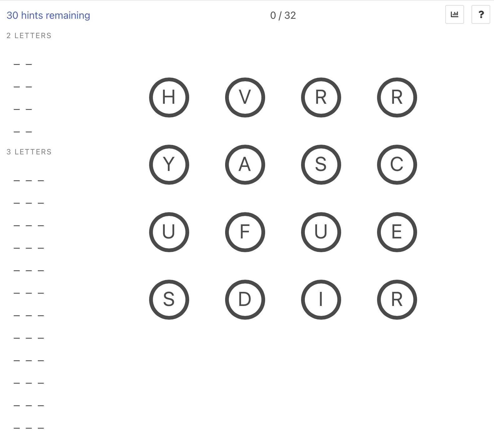

# Linkagram 

Make words by connecting letters. Each game is unique and you must find all the words.




## Config

You can change a few things by specifying URL parameters.


| Query Parameter  | Description | Default Value |
| ------------- | ------------- | -------------|
| id  | Seed for random number generator. Two games of the same size, words, letters and id will be identical  | `Math.random() * 10000` |
| width | Number of letter columns to generate | 4 |
| height | Number of letter rows to generate | 4 |

## Running locally

```
git clone ...
yarn dev
```

## How it's written

Typescript for the code, Bulma for the style. Pure DOM manipulation for the components

## How it works

1. When you load the page, a dictionary of available words and letter frequencies of the english language is loaded
2. The correct number of letter tiles are generated, with links between them to form a graph of letters
3. A `Trie` is built to find all words that can be made on this particular board
4. Each complete word entered by the user is checked to see if it's valid or not, or whether it's already been discovered in this game

## Interesting things

### Solver

There is a solver written in Python to build special grids with a known set of words.

Read more about how it works [here](solver/README.md)

### WASM Images

There is a path that dynamically generates an image of todays board for use with social media sharing. This is done by writing an SVG file with a 'custom font' and converting to PNG with WASM before streaming the response back to the client.

### Payments in a static site

The game gives you a limited number of hints but you can buy more. This is done by using a simple Stripe integration. The client sends a request to a Cloudflare function to create a payment intent, and then the client uses the Stripe SDK to complete the payment and update the hint count locally. There is no way around this. Nope. None at all. Definitely don't modify the local storage value yourself.